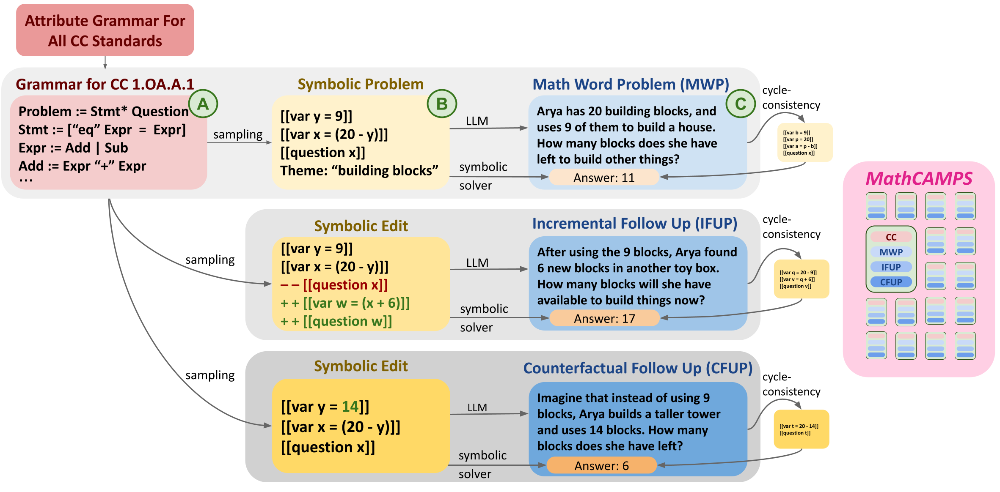
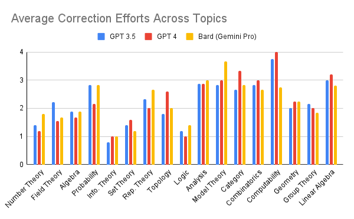
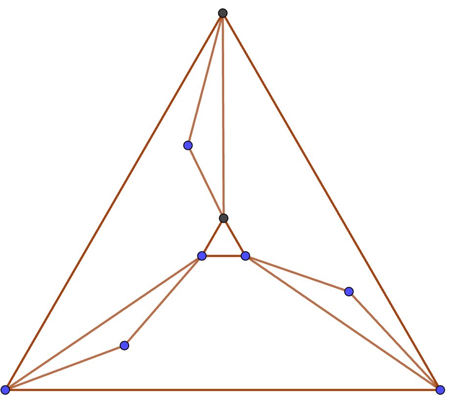
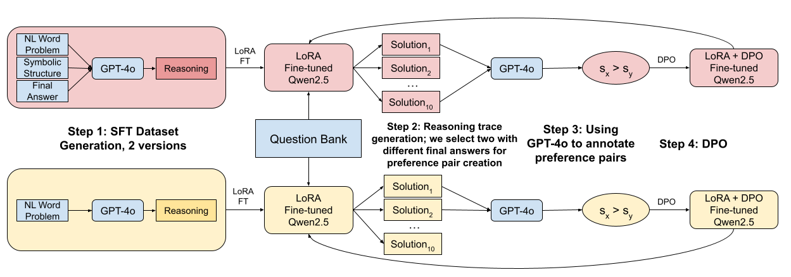
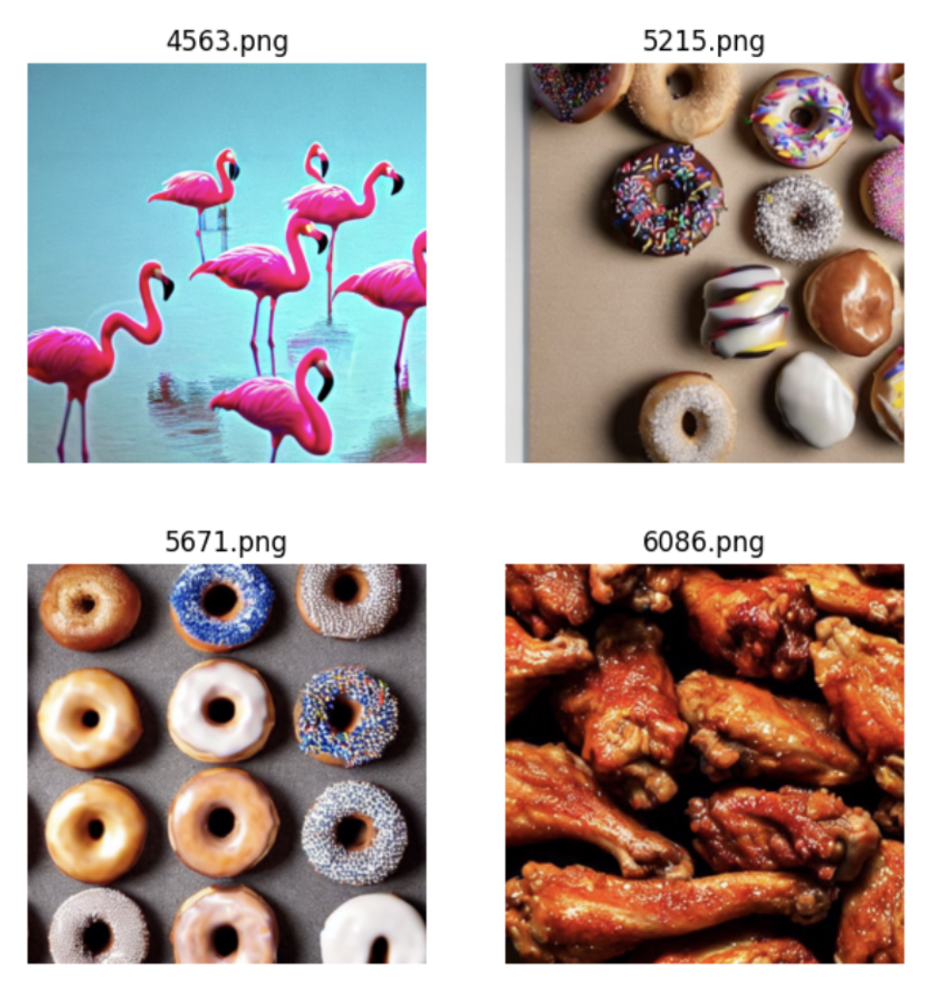
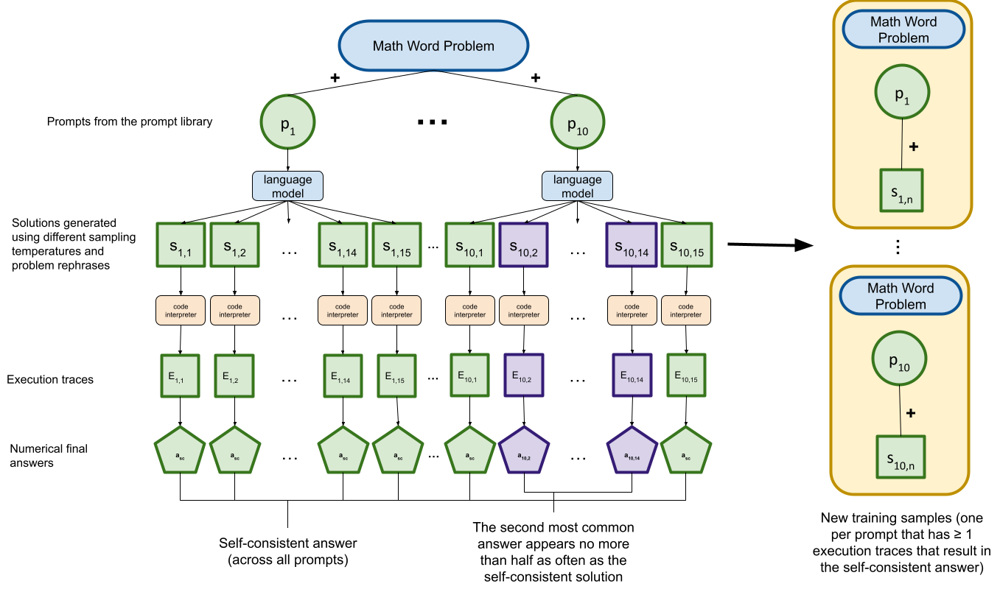
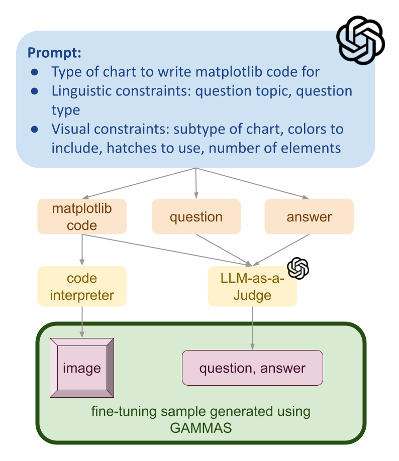

Hi! I'm Shubhra, a first-year PhD candidate at KTH Royal Institute of Technology in Stockholm, Sweden, advised by [Dr. David Broman](https://people.kth.se/~dbro/) and [Dr. Martin Monperrus](https://www.monperrus.net/martin/) funded by the [Wallenberg AI, Autonomous Systems and Software Program](https://wasp-sweden.org). I graduated with my B.S. + M.S. from Stanford University, where I studied Computer Science (AI track). 

There are two research directions I'm incredibly excited about: automated mathematical discovery (AMD) and reliable code generation. The two areas share two key challenges. 
* **Raising the abstraction.** Strong mathematical discoveries generally make mathematics more compressible/build better mathematical abstractions; similarly, good code abstracts away low-level details. 
* **Building intermediate representations** that can be iteratively refined and then verifiably compiled. The primary approach to code generation (which is also a part of theorem proving in AMD) has been to convert natural language directly to code. I believe that stronger intermediate representations that can be compared against executable/proof requirements will be the key to making code generation more reliable.

If these problems excite you, please reach out! I would love to chat.

<object
  type="image/svg+xml"
  data="../images/trains_of_thought.svg"
  class="research-map"
></object>

(trains of thought/lines of research inspired by [Kartik Chandra](https://cs.stanford.edu/~kach/))

---

# Publications
## 2024

  

    
  

  

    <h3 style="margin: 0;"> 
      MathCAMPS: Fine-grained Synthesis of Mathematical Problems From Human Curricula
    </h3>
    <i>NeurIPS Math-AI Workshop 2024</i>   
    <b>Shubhra Mishra</b>*, Gabriel Poesia*, Belinda Mo, Noah Goodman
     
    <a href="https://mathcamps.cc">[Website]</a>
    <a href="https://arxiv.org/abs/2407.00900">[arXiv]</a>
  

---

  

    
  

  

    <h3 style="margin: 0;"> 
      An Evaluation Benchmark for Autoformalization
    </h3>
    <i>ICLR 2024</i>  
    Aryan Gulati*, Devanshu Ladsaria*, <b>Shubhra Mishra</b>*, Jasdeep Sidhu*, Brando Miranda
     
    <a href="https://arxiv.org/abs/2406.06555">[arXiv]</a>
  

---

  

    
  

  

    <h3 style="margin: 0;"> 
      Families of Harris Graphs
    </h3>
    <i>In submission</i>  
    <b>Shubhra Mishra</b>, Doug Shaw, Francesca Gandini
     
    <a href="https://sites.google.com/view/harris-graphs/">[Website]</a>
    <a href="https://arxiv.org/abs/2312.10936">[arXiv]</a>
  

---

# Projects
## 2024

  

    
  

  

    <h3 style="margin: 0;"> 
      🏆 Can Symbolic Scaffolding and DPO Enhance Mathematical Problem-Solving Skills in LLMs?
    </h3>
    <i>CS 329H: Machine Learning from Human Preferences</i>   
    🏆 Outstanding Project Award for CS 329H  
    Paper coming soon! 
  

---

  

    
  

  

    <h3 style="margin: 0;"> 
      Improving Counting Abilities in Stable Diffusion Models
    </h3>
    <i>CS 468: Topics in Geometric Computing - 3D and 4D Foundation Models</i>   
    <a href="https://drive.google.com/file/d/1MWTOSqMJmf8QobD0jJU1gz22O1w3VADn/view?usp=sharing">[Paper]</a>
  

---

  

    
  

  

    <h3 style="margin: 0;"> 
      🏆 Self-Improvement for Math Problem-Solving in Small Language Models
    </h3>
    <i>CS 224N: Natural Language Processing with Deep Learning</i>  
    🏆 Outstanding Project Award for CS 224N  
    <a href="https://web.stanford.edu/class/archive/cs/cs224n/cs224n.1244/final-projects/ArtyomShaposhnikovRobertoGarciaTorresShubhraMishra.pdf">[Paper]</a>
  

---

  

    
  

  

    <h3 style="margin: 0;"> 
      GAMMAS: Improving Mathematical Reasoning in Vision Language Models Through Synthetic Data Generation
    </h3>
    <i>CS 231N: Deep Learning for Computer Vision</i>  
    <a href="https://drive.google.com/file/d/1AWcZ93xKpaMAAGD0CjOZzT5Ew6TonuAm/view?usp=sharing">[Paper]</a>
  

